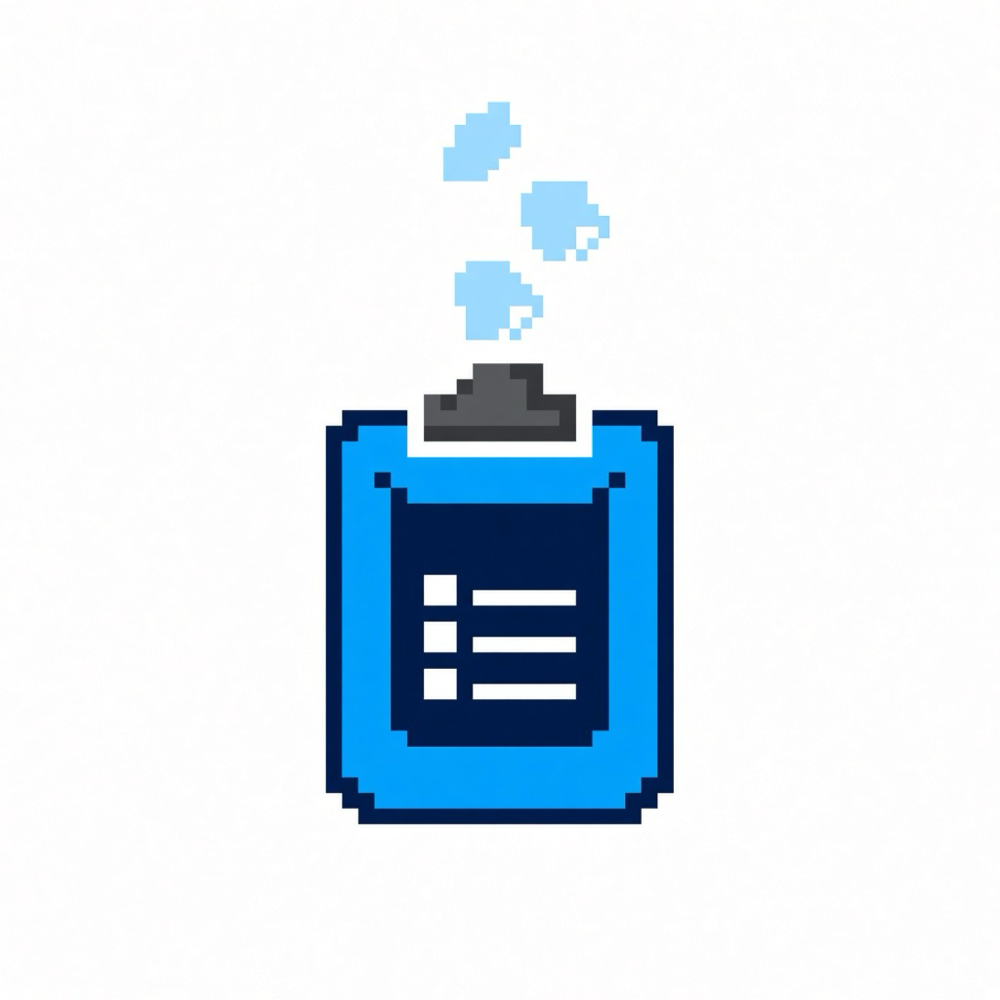

# 📋 ClipAI — The Next-Generation AI-Powered Smart Clipboard & Productivity Suite

<div align="center">



<h3>✨ Smart Clipboard · Multimodal AI · Ultra-Fast Snipping & Annotation · 100+ Prompts · 12 Liquid Themes · Wellness Timer</h3>

<p align="center">
  
  
  
  
  
  
  
</p>

[简体中文](README.md) · [English](README_EN.md)

</div>

---

## 🌟 About ClipAI

**ClipAI** is a premium, open-source smart clipboard manager and multimodal AI productivity suite crafted for developers, creators, researchers, and power users.

Engineered with 60fps frosted acrylic aesthetics tailored for **macOS and Windows 10/11**, ClipAI seamlessly integrates with **local and cloud-based Multimodal LLMs (DeepSeek, OpenAI, Claude, Gemini, Ollama, etc.)**, making every copy, screenshot, annotation, query, and writing workflow effortless.

---

## ✨ Feature Highlights

### 1. 📋 Smart Clipboard Management
* **All-Format Auto Capture**: Monitors text, code with syntax highlighting, high-res images, rich text, and links with intelligent hash deduplication.
* **Instant Fuzzy Search**: Global shortcut wake-up with `⌘F` / `Ctrl+F` instant search across "All / Text / Image / Favorites".
* **Pin, Favorite & History Capacity**: Favorite (⭐) and Pin (📌) key snippets. Customizable history size (50 to 1,000 items) and one-click cleanup of unfavorited items.
* **Structured Disk Storage & Quotas**: Images stored with structured disk persistence and LRU cache pruning to keep memory footprint ultra-light.

### 2. 📸 Ultra-Fast Crosshair Snipping & Canvas Annotation
* **Native Cross-Platform Snipping**:
  * **macOS & Windows 10/11 Native**: Zero external dependencies, millisecond startup response.
  * **Global Snipping Shortcut**: macOS `⌘⌥A` (or `⌥A`), Windows `Alt+A` / `Ctrl+Shift+A` (customizable/disableable).
  * **Smooth Interaction**: Precision crosshair selection, 8-point drag resizing, dynamic dimension badge, and `Space` for instant fullscreen selection.
  * **Instant Finish / Cancel**: Double-click or press `Enter` to copy & save; press `Esc` or right-click to exit without popup clutter.
* **HD Image Viewer & Annotation Suite (ImageViewer)**:
  * Click **`✏️ Annotate & Edit`** on the selection bar to enter the full canvas annotation studio.
  * **Full Annotation Toolbox**: Rectangles, ellipses, arrows, freehand pen brush, text typography (with size & color pickers), mosaic blurring, undo, and clear screen.
  * **Image Canvas Controls**: Seamless zoom, 90° rotation, fit-to-window, copy to clipboard, and save to disk.
  * **AI Vision & Multimodal OCR**: Click **`✨ Ask AI`** directly in the editor for instant **OCR text extraction**, **translation**, **chart analysis**, and **code solving**.

### 3. 🤖 Multimodal AI Assistant
* **Aggregated Multi-Provider Support**: Out-of-the-box support for **DeepSeek**, **OpenAI (GPT-4o)**, **Anthropic (Claude 3.5 Sonnet)**, **Google (Gemini 1.5 Pro / Flash)**, **Ollama (local offline models)**, and any OpenAI-compatible API.
* **One-Click Model Discovery**: Automatically queries and populates available models from your API account without manual configurations.
* **High-Frequency AI Actions**:
  * ✨ **Polish Article**: Enhance clarity, tone, and professional expressiveness.
  * 📝 **Smart Summary**: Distill long articles into bullet-point takeaways.
  * 🔍 **Grammar Check**: Correct typos, punctuation, and grammatical issues.
  * 💡 **Code Breakdown**: Explain algorithms and code logic in plain language.
  * 🐞 **Find & Fix Bugs**: Identify edge cases, vulnerabilities, and optimization paths.
  * 📊 **Structure into Table**: Convert unstructured text/JSON into clean Markdown tables.
  * 🌐 **Multilingual Translation**: Accurate and nuanced translation across 8 languages.

### 4. 🌟 100+ Prompt Center
* **4-in-1 Prompt Vault**: **Curated (100+)**, **Custom User Library**, **Favorites**, and **Recent**.
* **Comprehensive Categories**: Software Development, Copywriting, Productivity, Academia & Research, Creative Design, Daily Life, etc.
* **Clone & Customize**: Clone any curated prompt to your private library with one click for custom adjustments.
* **Import & Export**: Standard JSON backup and cross-device synchronization.

### 5. ⏱️ Wellness & Pomodoro Focus Timer
* **Dynamic Island Pill Timer**: Top bar breathing capsule shows remaining time without taking screen estate.
* **Science-Backed Health Presets**:
  * 💧 **Hydration Reminder** (Recommended 45 mins)
  * 🚶 **Stand & Stretch** (Recommended 50 mins)
  * 🍱 **Meal Reminder** (Lunch / Dinner)
  * 🍅 **Classic Pomodoro** (25 mins focus + 5 mins rest)
  * 👀 **20-20-20 Eye Relax** (Look 20 feet away for 20 seconds every 20 mins)
* **Audio & Native Notifications**: Web Audio harmonic chords + OS Native Notification Center alerts with "Snooze 5 mins" option.
* **Daily Wellness Dashboard**: Track daily focus sessions and health goals at a glance.

### 6. 🎨 12 Frosted Glass Themes & Customization
* **12 Curated Visual Themes**:
  * 📱 **iOS Liquid Glass** (Dynamic Island Translucent Acrylic)
  * 💎 **Linear Obsidian** (Aurora Indigo · Deep Obsidian Night)
  * ⚡ **Raycast Crimson** (Midnight Abyss · Crimson Energy)
  * 🌈 **Arc Neon Mesh** (Fluid Gradient · Aurora Neon Mesh)
  * 🧊 **Sequoia Glacier** (macOS Glacier Blue · Crystal Glass)
  * 🌲 **Emerald Aurora**, 🌅 **Sunset Amber**, 👾 **Hacker Matrix**, 🏙️ **Apple Ceramic White**, ☕ **Warm Sunlight Velvet**, 🌫️ **Fir Mist Blue**, and more.
* **Custom Wallpaper Upload**: Supports custom image backgrounds with continuous **Frosted Blur** and **Dim Overlay** sliders.
* **Window Opacity Control**: Adjust transparency from 65% to 100% to view code/documentation beneath.
* **Layout Density**: Compact, Standard, and Relaxed spacing.

### 7. 🌐 8-Language Deep Internationalization (i18n)
All interfaces (Main Dashboard, Settings, Snipping Bar, Annotation Studio) feature complete native localization with hot switching:
- 🇨🇳 简体中文 (zh-CN)
- 🇭🇰 繁體中文 (zh-TW)
- 🇺🇸 English (en-US)
- 🇯🇵 日本語 (ja-JP)
- 🇰🇷 한국어 (ko-KR)
- 🇪🇸 Español (es-ES)
- 🇩🇪 Deutsch (de-DE)
- 🇫🇷 Français (fr-FR)

### 8. 🔒 Enterprise-Grade Security & Privacy
* **100% Offline-First**: All history and images remain on your machine; no telemetry or data harvesting.
* **Hardware-Level Encryption**: API keys stored with system hardware protection (Electron `safeStorage` / OS Keychain / DPAPI).
* **Full-Stack Masking**: Sensitive keys masked in UI and sanitize logs to prevent accidental screen/log leakage.
* **Automatic Disaster-Recovery Backups**: Redacted configuration backups created at launch.

---

## ⌨️ Shortcuts Reference

| Action | macOS Shortcut | Windows Shortcut |
| :--- | :--- | :--- |
| **Wake / Hide ClipAI Window** | <kbd>⌥ + Space</kbd> (or <kbd>⌘ + ⇧ + V</kbd>) | <kbd>Ctrl + Shift + V</kbd> (or <kbd>Alt + V</kbd>) |
| **Interactive Screen Snipping** | <kbd>⌥ + A</kbd> (or <kbd>⌘ + ⌥ + A</kbd>) | <kbd>Alt + A</kbd> (or <kbd>Ctrl + Shift + A</kbd>) |
| **Focus Search Bar** | <kbd>⌘ + F</kbd> | <kbd>Ctrl + F</kbd> |
| **Send AI Chat / Prompt** | <kbd>⌘ + Enter</kbd> | <kbd>Ctrl + Enter</kbd> |
| **Fullscreen Snipping Selection** | <kbd>Space</kbd> | <kbd>Space</kbd> |
| **Finish & Copy Snipping** | <kbd>Enter</kbd> (or Double-Click) | <kbd>Enter</kbd> (or Double-Click) |
| **Cancel Snipping / Close Dialog** | <kbd>Esc</kbd> (or Right-Click) | <kbd>Esc</kbd> (or Right-Click) |

---

## 📦 Downloads

Download official binaries for **v0.1.3** from [GitHub Releases](https://github.com/jasperJu111/clipai/releases):

| Platform | Architecture | Installer Type | Filename |
| :--- | :--- | :--- | :--- |
| **Windows** | x64 (64-bit) | NSIS Installer | `ClipAI-0.1.3-windows-x64-setup.exe` |
| **macOS** | Universal (Apple Silicon & Intel) | DMG Image | `ClipAI-0.1.3-universal.dmg` |
| **macOS** | Universal | Portable ZIP | `ClipAI-0.1.3-universal-mac.zip` |

---

## 🛠️ Development & Building

```bash
# 1. Clone the repository
git clone https://github.com/jasperJu111/clipai.git
cd clipai

# 2. Install dependencies
npm install

# 3. Start development server
npm run dev

# 4. Run automated test suite (81 tests)
npm test

# 5. Build distribution packages
npm run package:mac   # Build macOS Universal DMG
npm run package:win   # Build Windows x64 NSIS Installer
```

---

## 📄 License

This project is open-sourced under the [MIT License](LICENSE).
